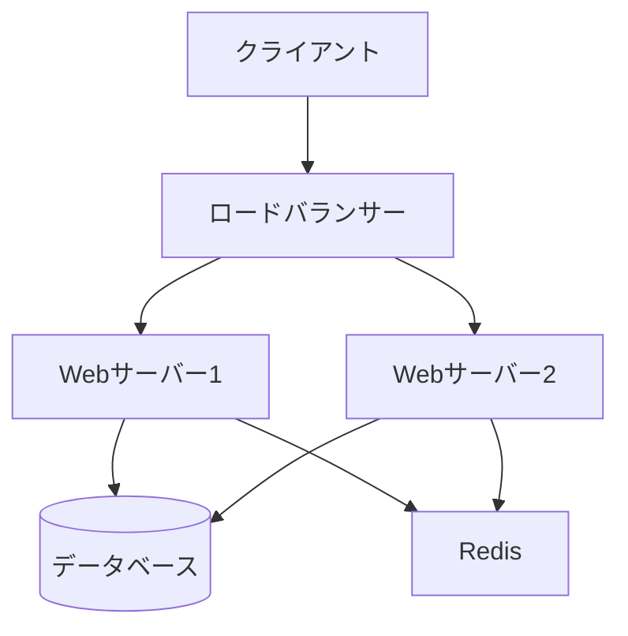

# Azure Wiki Generator Skill

Azure DevOps Wikiページを生成するスキルです。

## 主な機能

- **Wikiページ作成**: Markdown形式
- **目次生成**: 階層構造
- **ドキュメントテンプレート**: プロジェクトドキュメント
- **図表埋め込み**: Mermaid、画像

## Wikiページ作成

### ホームページ

```markdown
# プロジェクトWiki

## 概要

このWikiにはプロジェクトのドキュメントが含まれています。

## 目次

- [アーキテクチャ](Architecture)
- [開発ガイド](Development-Guide)
- [デプロイメント](Deployment)
- [API仕様](API-Reference)

## クイックスタート

1. [環境セットアップ](Setup)
2. [ローカル開発](Local-Development)
3. [テスト実行](Testing)
```

### アーキテクチャページ

```markdown
# システムアーキテクチャ

## 概要図



## コンポーネント

### フロントエンド
- React 18
- TypeScript
- Tailwind CSS

### バックエンド
- Node.js + Express
- PostgreSQL
- Redis

### インフラ
- Azure App Service
- Azure Database for PostgreSQL
- Azure Cache for Redis
```

## Git操作でWiki更新

```bash
# Wikiリポジトリのクローン
git clone https://dev.azure.com/myorg/MyProject/_git/MyProject.wiki

cd MyProject.wiki

# 新ページ作成
cat > API-Reference.md << 'WIKI'
# API リファレンス

## エンドポイント

### GET /api/users
ユーザー一覧を取得

**レスポンス:**
```json
{
  "users": [
    {
      "id": 1,
      "name": "John Doe"
    }
  ]
}
```
WIKI

# コミット＆プッシュ
git add .
git commit -m "Add API Reference page"
git push
```

## ページテンプレート

### 機能仕様

```markdown
# [機能名]

## 概要
[機能の簡単な説明]

## 要件
- 要件1
- 要件2

## ユースケース
1. ユーザーが...
2. システムは...

## UI/UX
[スクリーンショットまたはモックアップ]

## 技術仕様
### データモデル
### API
### セキュリティ

## テスト計画
- [ ] ユニットテスト
- [ ] 統合テスト
- [ ] E2Eテスト
```

## バージョン情報
- Version: 1.0.0
