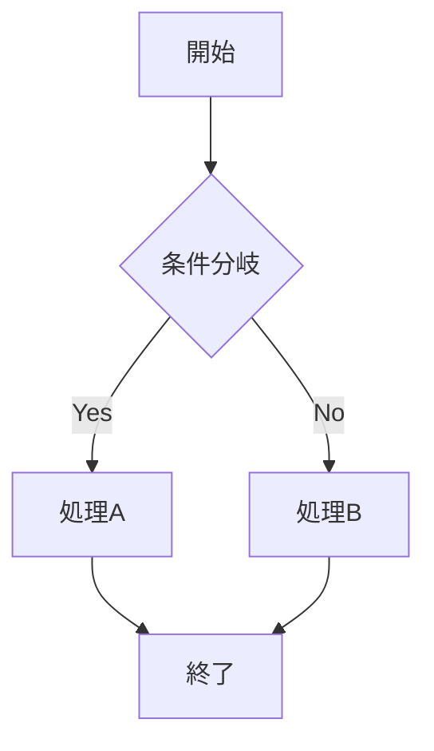
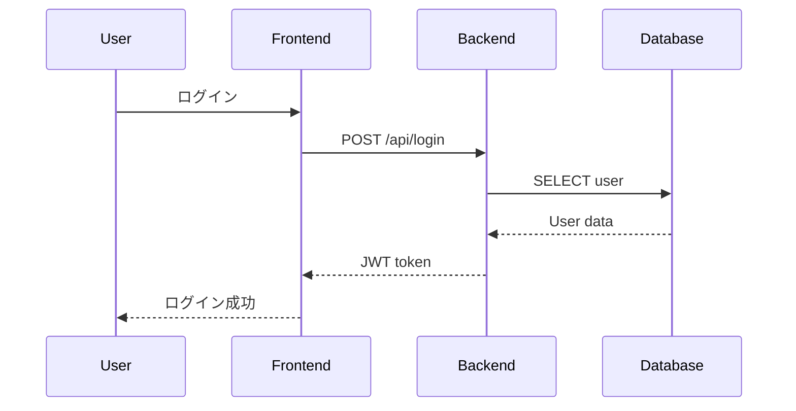
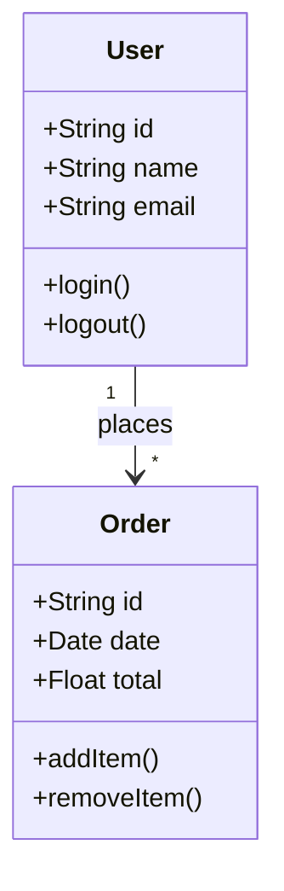
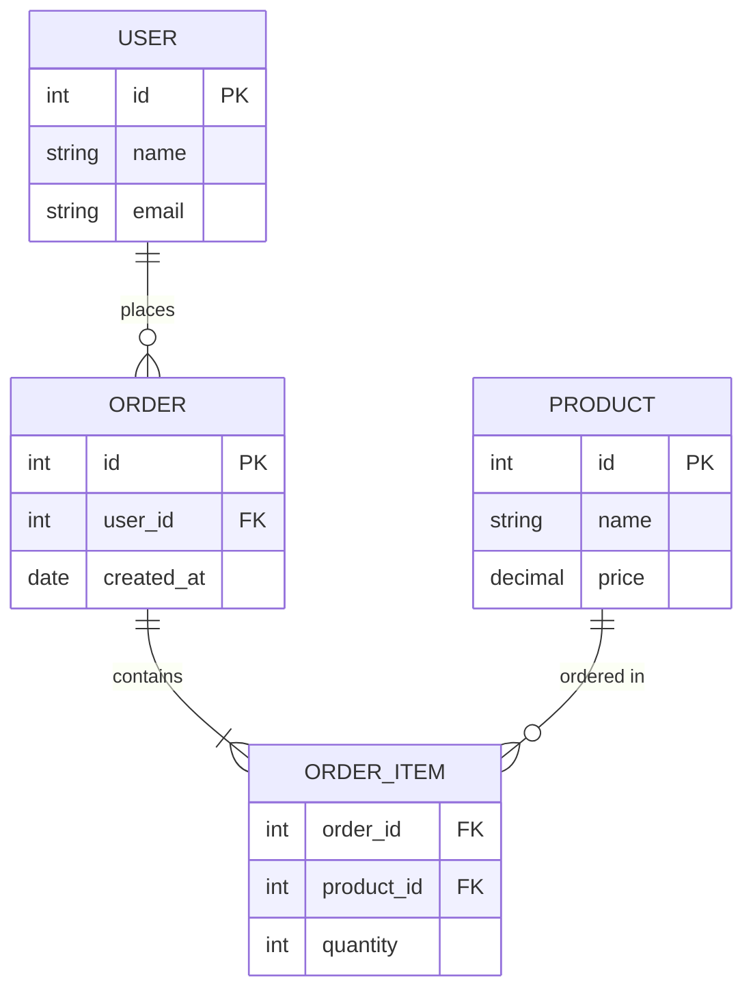
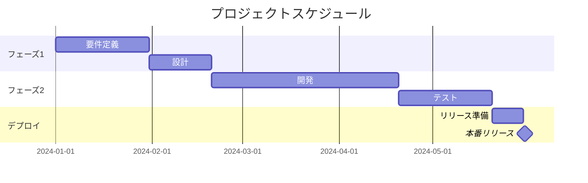
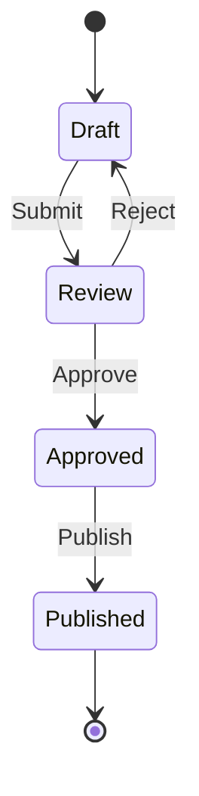
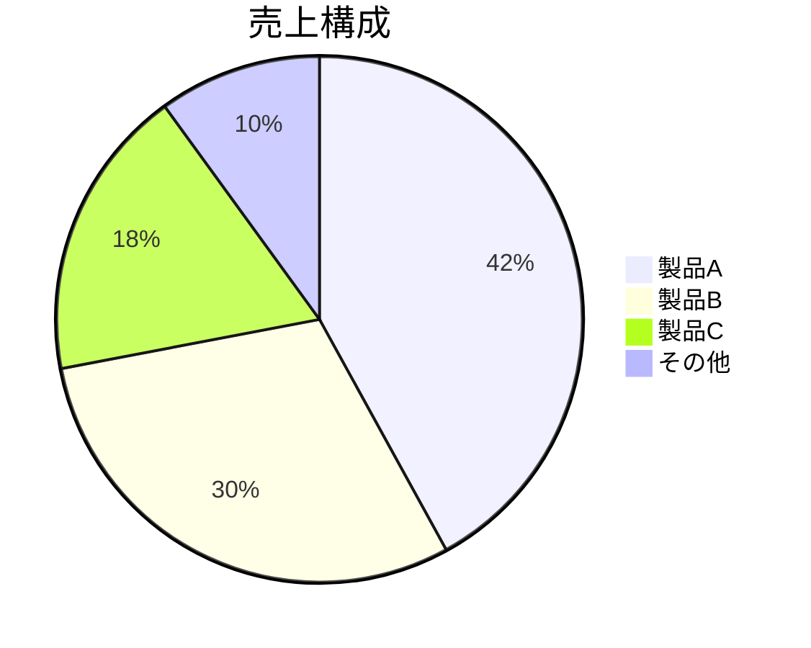
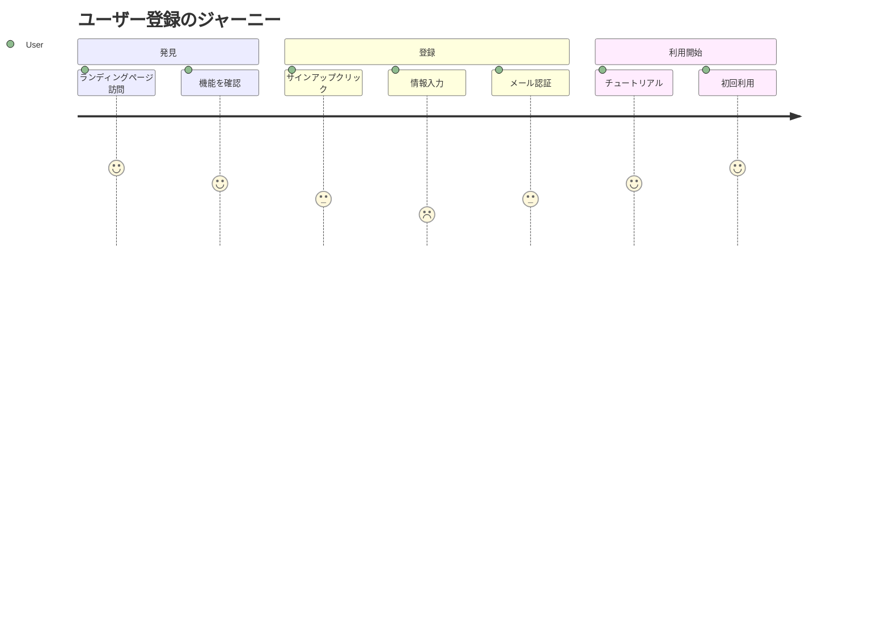

# Mermaid Diagram Skill

Mermaid記法でダイアグラムを生成するスキルです。

## 概要

フローチャート、シーケンス図、ガントチャート等をテキストから生成します。

## 主な機能

- **フローチャート**: プロセスフロー
- **シーケンス図**: インタラクション
- **クラス図**: UML クラス図
- **ER図**: データベース設計
- **ガントチャート**: プロジェクト管理
- **パイチャート**: 割合表示
- **状態遷移図**: ステートマシン
- **ジャーニーマップ**: ユーザージャーニー

## 使用方法

```
以下のプロセスのフローチャートをMermaidで作成：
1. ユーザー登録
2. メール検証
3. プロフィール設定
```

## ダイアグラムタイプ

### フローチャート



```
graph TD
    A[開始] --> B{条件分岐}
    B -->|Yes| C[処理A]
    B -->|No| D[処理B]
    C --> E[終了]
    D --> E
```

### シーケンス図



```
sequenceDiagram
    participant User
    participant Frontend
    participant Backend
    participant Database

    User->>Frontend: ログイン
    Frontend->>Backend: POST /api/login
    Backend->>Database: SELECT user
    Database-->>Backend: User data
    Backend-->>Frontend: JWT token
    Frontend-->>User: ログイン成功
```

### クラス図



```
classDiagram
    class User {
        +String id
        +String name
        +String email
        +login()
        +logout()
    }
    class Order {
        +String id
        +Date date
        +Float total
        +addItem()
        +removeItem()
    }
    User "1" --> "*" Order : places
```

### ER図



```
erDiagram
    USER ||--o{ ORDER : places
    ORDER ||--|{ ORDER_ITEM : contains
    PRODUCT ||--o{ ORDER_ITEM : "ordered in"

    USER {
        int id PK
        string name
        string email
    }
```

### ガントチャート



```
gantt
    title プロジェクトスケジュール
    dateFormat  YYYY-MM-DD
    section フェーズ1
    要件定義           :a1, 2024-01-01, 30d
    設計               :a2, after a1, 20d
```

### 状態遷移図



```
stateDiagram-v2
    [*] --> Draft
    Draft --> Review : Submit
    Review --> Approved : Approve
    Review --> Draft : Reject
    Approved --> Published : Publish
    Published --> [*]
```

### パイチャート



```
pie title 売上構成
    "製品A" : 42
    "製品B" : 30
    "製品C" : 18
    "その他" : 10
```

### ユーザージャーニー



## HTMLへの埋め込み

```html
<!DOCTYPE html>
<html>
<head>
  <script src="https://cdn.jsdelivr.net/npm/mermaid/dist/mermaid.min.js"></script>
  <script>mermaid.initialize({ startOnLoad: true });</script>
</head>
<body>
  <div class="mermaid">
    graph TD
        A[開始] --> B[処理]
        B --> C[終了]
  </div>
</body>
</html>
```

## ベストプラクティス

1. **明確なラベル**: ノード名を分かりやすく
2. **方向性**: TD（上下）、LR（左右）を適切に選択
3. **色分け**: 重要な部分を強調
4. **コメント**: 複雑な図には説明を追加

## バージョン情報

- スキルバージョン: 1.0.0
- 最終更新: 2025-01-22
