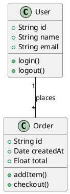
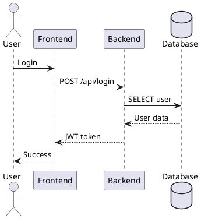

# PlantUML Diagram Skill

PlantUML記法でUML図を生成するスキルです。

## 主な機能

- **クラス図**: UML class diagrams
- **シーケンス図**: Interaction diagrams
- **アクティビティ図**: Workflow diagrams
- **コンポーネント図**: Architecture diagrams

## クラス図

## シーケンス図

## バージョン情報
- Version: 1.0.0
