# UML Diagram Generation Skill - 使い方ガイド

MermaidとPlantUMLを使用してUML図とダイアグラムを生成するスキルです。

## クイックスタート

### 1. 基本的な使い方

Claude Codeで以下のようにリクエストします：

```
シーケンス図を作成してください。
User → API: ログインリクエスト
API → Database: ユーザー検証
Database → API: ユーザー情報
API → User: JWT トークン
```

### 2. 生成された図の表示

```bash
# ブラウザで直接開く
open diagram.html

# またはローカルサーバーで
python -m http.server 8000
# ブラウザで http://localhost:8000/diagram.html を開く
```

### 3. サンプルを見る

`example-diagrams.html` をブラウザで開いて、様々な図のサンプルを確認できます。

## ファイル構成

```
.claude/skills/uml-diagram/
├── skill.md              # スキルの説明
├── template.html         # 図生成テンプレート
├── example-diagrams.html # サンプル図集
└── README.md             # このファイル
```

## 図タイプ別ガイド

### 1. フローチャート

**用途**: アルゴリズム、業務プロセス

**基本構文（Mermaid）**:
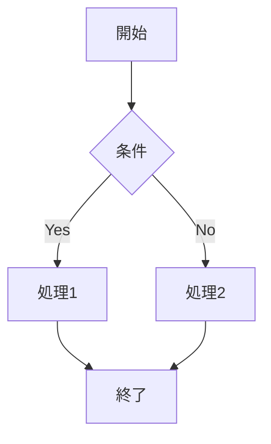

**リクエスト例**:
```
注文処理のフローチャートを作成:
開始 → 商品選択 → カートに追加
→ 在庫確認
  → 在庫あり: 決済へ → 完了
  → 在庫なし: エラー表示 → 終了
```

**図形の種類**:
- `[矩形]` - 処理
- `{菱形}` - 条件分岐
- `([楕円])` - 開始/終了
- `[[サブルーチン]]` - サブプロセス
- `[(データベース)]` - データ
- `((円))` - 接続点

**矢印の種類**:
- `-->` - 実線矢印
- `-.->` - 点線矢印
- `==>` - 太線矢印
- `--テキスト-->` - ラベル付き矢印

### 2. シーケンス図

**用途**: オブジェクト間の相互作用

**基本構文（Mermaid）**:
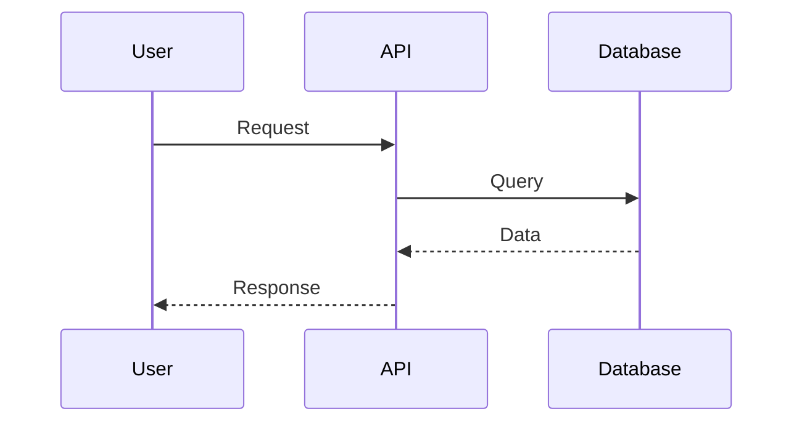

**リクエスト例**:
```
ユーザー登録のシーケンス図:
User → Frontend: 登録情報入力
Frontend → API: POST /register
API → Validator: 入力検証
Validator → API: 検証結果
API → Database: ユーザー作成
Database → API: 成功
API → EmailService: 確認メール送信
API → Frontend: 登録完了
Frontend → User: 完了画面表示
```

**メッセージの種類**:
- `->>` - 同期メッセージ（実線矢印）
- `-->>` - 応答メッセージ（点線矢印）
- `-x` - 非同期メッセージ
- `--x` - 非同期応答

**その他の要素**:
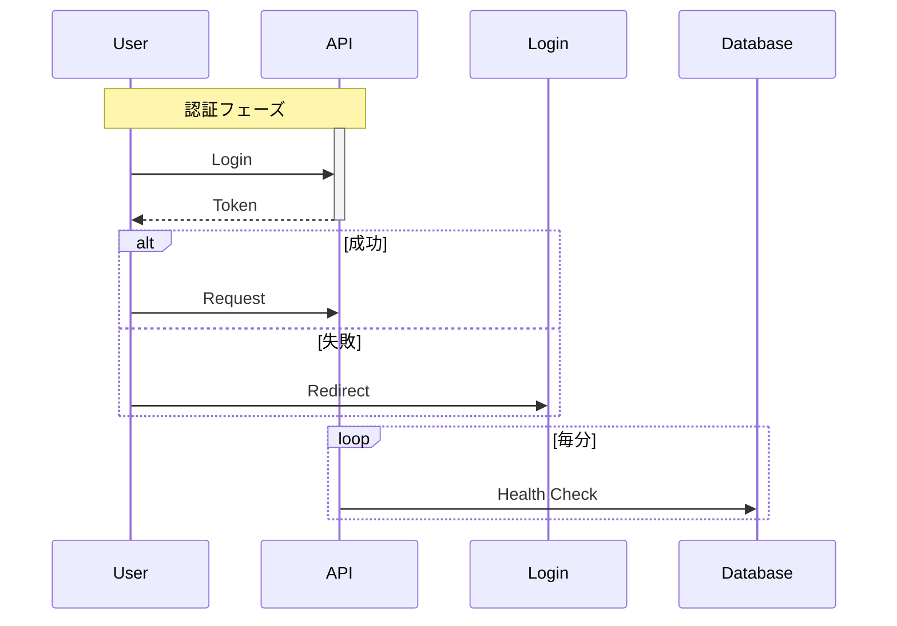

### 3. クラス図

**用途**: オブジェクト指向設計

**基本構文（Mermaid）**:
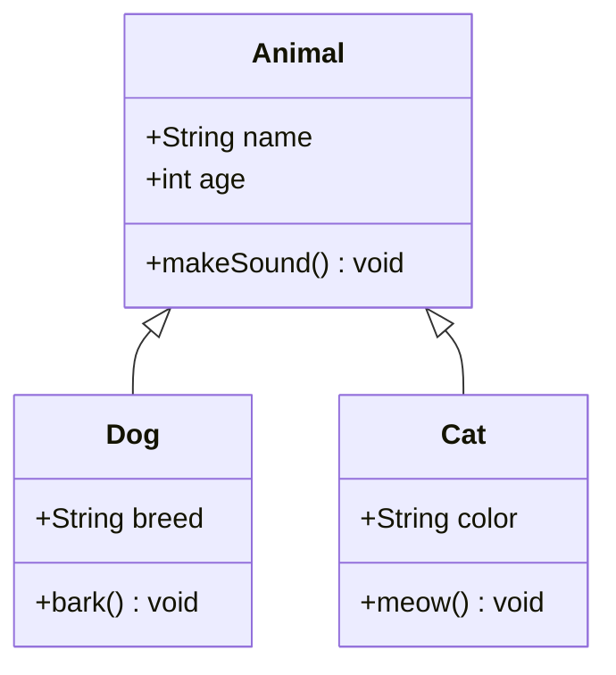

**リクエスト例**:
```
ECサイトのクラス図:

クラス:
- User
  - id: int
  - name: string
  - email: string
  - login(): bool
  - logout(): void

- Order
  - id: int
  - userId: int
  - totalAmount: decimal
  - status: OrderStatus
  - calculate(): decimal
  - submit(): void

- Product
  - id: int
  - name: string
  - price: decimal
  - stock: int
  - getPrice(): decimal
  - updateStock(qty: int): void

関係:
- User "1" -- "*" Order : 注文する
- Order "*" -- "*" Product : 含む
```

**可視性**:
- `+` Public
- `-` Private
- `#` Protected
- `~` Package

**関係の種類**:
- `<|--` - 継承（実線三角）
- `<|..` - 実装（点線三角）
- `*--` - コンポジション（実線菱形）
- `o--` - 集約（白抜き菱形）
- `-->` - 関連（実線矢印）
- `..>` - 依存（点線矢印）

### 4. ER図（エンティティ関係図）

**用途**: データベース設計

**基本構文（Mermaid）**:
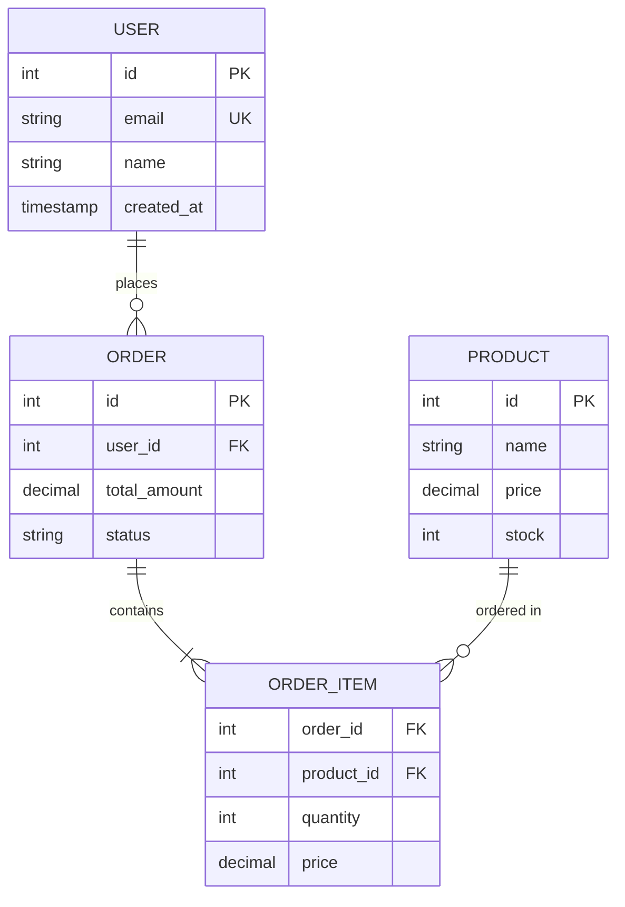

**リクエスト例**:
```
ブログシステムのER図:

エンティティ:
1. users
   - id (PK)
   - username (UNIQUE)
   - email (UNIQUE)
   - password_hash

2. posts
   - id (PK)
   - user_id (FK → users)
   - title
   - content
   - published_at

3. comments
   - id (PK)
   - post_id (FK → posts)
   - user_id (FK → users)
   - content
   - created_at

4. tags
   - id (PK)
   - name (UNIQUE)

5. post_tags
   - post_id (FK → posts)
   - tag_id (FK → tags)

リレーション:
- users 1--* posts
- users 1--* comments
- posts 1--* comments
- posts *--* tags (through post_tags)
```

**リレーションの種類**:
- `||--||` - 1対1（両側必須）
- `||--o{` - 1対多（左必須、右任意）
- `}o--o{` - 多対多（両側任意）
- `||--|{` - 1対多（両側必須）

### 5. ステート図（状態遷移図）

**用途**: オブジェクトの状態管理

**基本構文（Mermaid）**:
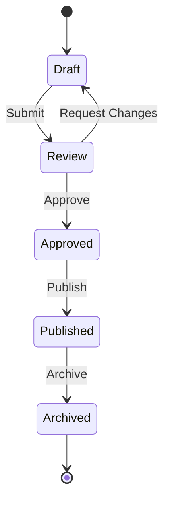

**リクエスト例**:
```
記事投稿の状態遷移図:
状態:
- 下書き
- レビュー待ち
- 承認済み
- 公開済み
- アーカイブ

遷移:
下書き --[投稿]--> レビュー待ち
レビュー待ち --[承認]--> 承認済み
レビュー待ち --[却下]--> 下書き
承認済み --[公開]--> 公開済み
公開済み --[アーカイブ]--> アーカイブ
```

### 6. ガントチャート

**用途**: プロジェクトスケジュール

**基本構文（Mermaid）**:
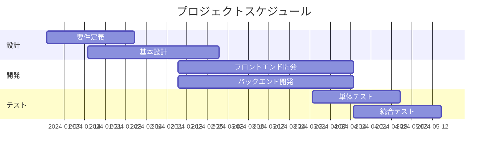

**リクエスト例**:
```
Webアプリ開発のガントチャート:
期間: 2024年1月〜6月

フェーズ1: 企画・設計（1月〜2月）
- 要件定義: 1/1-1/31
- UI/UX設計: 1/15-2/15
- システム設計: 2/1-2/28

フェーズ2: 開発（3月〜4月）
- フロントエンド: 3/1-4/30
- バックエンド: 3/1-4/30
- API開発: 3/15-4/15

フェーズ3: テスト（5月）
- 単体テスト: 5/1-5/15
- 統合テスト: 5/10-5/25

フェーズ4: リリース（6月）
- ステージング: 6/1-6/10
- 本番リリース: 6/15
```

### 7. パイチャート

**用途**: 割合の可視化

**基本構文（Mermaid）**:
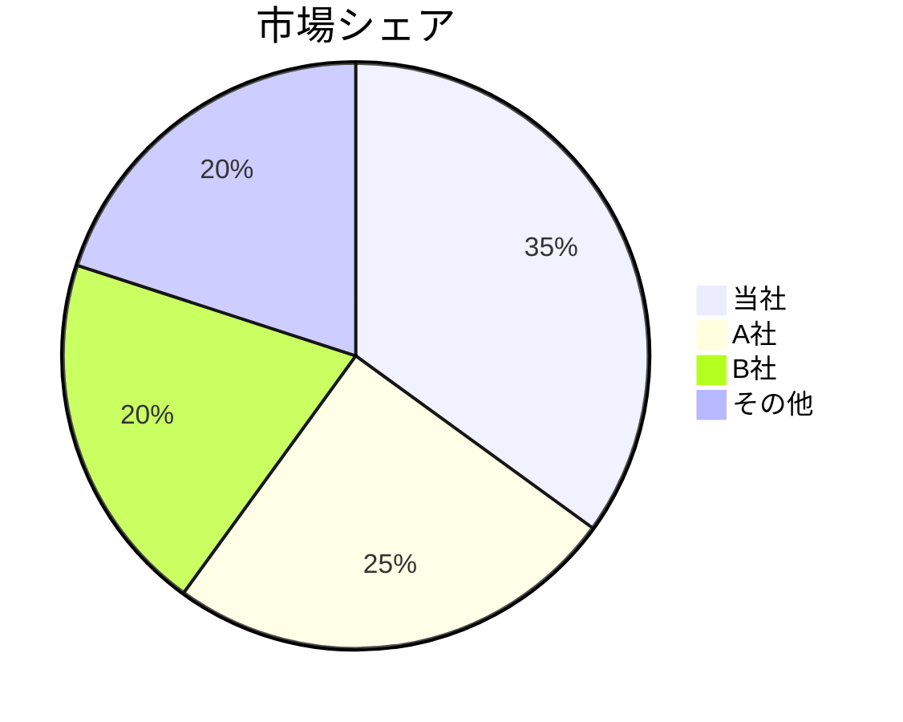

### 8. Gitグラフ

**用途**: ブランチ戦略の可視化

**基本構文（Mermaid）**:
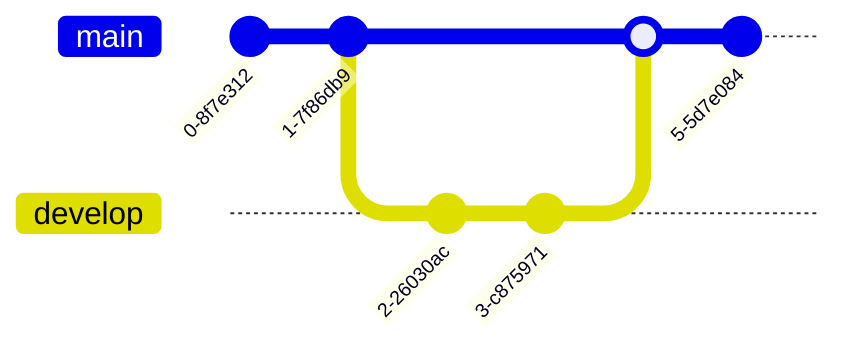

## レイアウト方向

フローチャートやグラフの方向を指定できます：

- `graph TD` - 上から下（Top to Down）
- `graph LR` - 左から右（Left to Right）
- `graph RL` - 右から左（Right to Left）
- `graph BT` - 下から上（Bottom to Top）

**例**:
```
横向きのフローチャートを作成:
graph LR
    A[開始] --> B[処理1] --> C[処理2] --> D[終了]
```

## スタイルとテーマ

### Mermaidテーマ

```
ダークテーマでクラス図を作成
テーマ: dark
```

利用可能なテーマ:
- `default` - デフォルト
- `neutral` - ニュートラル
- `dark` - ダーク
- `forest` - フォレスト
- `base` - ベース

### カスタムスタイル

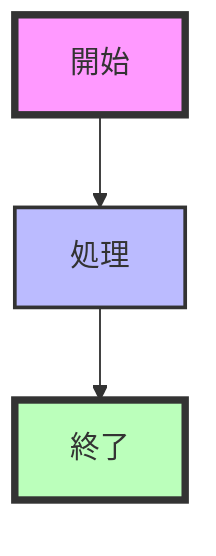

## 複雑な図の例

### マイクロサービスアーキテクチャ

```
マイクロサービスアーキテクチャ図を作成:

graph TB
    subgraph "クライアント層"
        Web[Web App]
        Mobile[Mobile App]
    end

    subgraph "API Gateway"
        Gateway[Kong/Nginx]
    end

    subgraph "サービス層"
        UserService[User Service]
        OrderService[Order Service]
        PaymentService[Payment Service]
        NotificationService[Notification Service]
    end

    subgraph "データ層"
        UserDB[(User DB)]
        OrderDB[(Order DB)]
        Cache[(Redis)]
    end

    subgraph "メッセージング"
        Queue[RabbitMQ]
    end

    Web --> Gateway
    Mobile --> Gateway
    Gateway --> UserService
    Gateway --> OrderService
    Gateway --> PaymentService

    UserService --> UserDB
    OrderService --> OrderDB
    PaymentService --> Queue
    Queue --> NotificationService

    UserService --> Cache
    OrderService --> Cache
```

### 認証フロー（詳細）

```
OAuth2.0 認証フローの詳細シーケンス図:

sequenceDiagram
    actor User
    participant App as Client App
    participant Auth as Auth Server
    participant API as Resource Server

    Note over User,API: 認可フロー

    User->>App: 1. ログインボタンクリック
    App->>Auth: 2. 認可リクエスト<br/>(client_id, redirect_uri, scope)

    Auth->>User: 3. ログイン画面表示
    User->>Auth: 4. 認証情報入力

    alt 認証成功
        Auth->>User: 5a. 認可確認画面
        User->>Auth: 6a. 許可
        Auth->>App: 7a. 認可コード

        Note over App,Auth: トークン交換

        App->>Auth: 8. トークンリクエスト<br/>(code, client_secret)
        Auth->>Auth: 9. 検証
        Auth->>App: 10. アクセストークン<br/>リフレッシュトークン

        Note over App,API: リソースアクセス

        App->>API: 11. APIリクエスト<br/>(Bearer token)
        API->>API: 12. トークン検証
        API->>App: 13. リソース返却
        App->>User: 14. データ表示

    else 認証失敗
        Auth->>User: 5b. エラー表示
        User->>App: 6b. リダイレクト
    end
```

## エクスポート機能

### SVGエクスポート

生成されたHTMLには、図をSVG形式でダウンロードする機能があります。

```javascript
// ブラウザのコンソールで
const svg = document.querySelector('svg');
const serializer = new XMLSerializer();
const svgString = serializer.serializeToString(svg);
const blob = new Blob([svgString], {type: 'image/svg+xml'});
const url = URL.createObjectURL(blob);

const link = document.createElement('a');
link.download = 'diagram.svg';
link.href = url;
link.click();
```

### PNGエクスポート

```javascript
// SVGをPNGに変換
const canvas = document.createElement('canvas');
const ctx = canvas.getContext('2d');
const img = new Image();
img.onload = () => {
    canvas.width = img.width;
    canvas.height = img.height;
    ctx.drawImage(img, 0, 0);
    const pngUrl = canvas.toDataURL('image/png');

    const link = document.createElement('a');
    link.download = 'diagram.png';
    link.href = pngUrl;
    link.click();
};
img.src = 'data:image/svg+xml;base64,' + btoa(svgString);
```

## ベストプラクティス

### 図の設計原則

1. **1図1目的**: 1つの図で1つの概念を表現
2. **適切な抽象度**: 詳細すぎず簡潔すぎず
3. **一貫性**: 命名規則、スタイルを統一
4. **読みやすさ**: 左→右、上→下のフロー
5. **シンプル**: 要素は10〜15個まで

### 命名規則

- **クラス名**: PascalCase（例: UserService）
- **メソッド名**: camelCase（例: getUserById）
- **データベース**: snake_case（例: user_id）
- **定数**: UPPER_CASE（例: MAX_RETRY）

### 色の使い方

- **重要な要素**: 赤、オレンジ
- **正常フロー**: 青、緑
- **エラーフロー**: 赤
- **外部システム**: グレー

## トラブルシューティング

### 構文エラー

**症状**: 図が表示されない

**確認項目**:
1. ブラウザの開発者コンソールでエラー確認
2. Mermaid Live Editorで構文検証
3. インデントの確認（特にサブグラフ）

**よくあるエラー**:
```
❌ graph TD
    A[開始] -> B[終了]  // 矢印が間違い

✅ graph TD
    A[開始] --> B[終了]
```

### レイアウトの問題

**症状**: 図が重なる、配置がおかしい

**解決策**:
1. レイアウト方向を変更（TD → LR）
2. サブグラフで整理
3. 図を分割

### 日本語表示の問題

**症状**: 日本語が文字化け

**解決策**:
1. HTMLファイルのエンコーディングをUTF-8に設定
2. 日本語フォントを指定
3. ブラウザの文字エンコーディング設定確認

### パフォーマンスの問題

**症状**: 図の読み込みが遅い

**解決策**:
1. 要素数を減らす（分割）
2. アニメーションを無効化
3. サブグラフで階層化

## Markdown統合

生成されたMermaidコードは、Markdownファイルに直接埋め込めます：

```markdown
# システム設計

## アーキテクチャ図

​```mermaid
graph TD
    A[Frontend] --> B[API Gateway]
    B --> C[Service 1]
    B --> D[Service 2]
​```
```

GitHub、GitLab、Notion、Obsidianなど、多くのプラットフォームで表示できます。

## 参考リンク

- [Mermaid 公式ドキュメント](https://mermaid.js.org/)
- [Mermaid Live Editor](https://mermaid.live/) - オンラインエディタ
- [PlantUML 公式サイト](https://plantuml.com/)
- [PlantUML Web Server](http://www.plantuml.com/plantuml/)
- [UML入門](https://www.uml.org/)

## よくある質問

### Q: MermaidとPlantUMLどちらを使うべき？

**A**: 一般的にはMermaidを推奨します。理由:
- ブラウザで直接レンダリング（軽量）
- シンプルな構文
- GitHub/GitLabで標準サポート
- リアルタイムプレビュー

PlantUMLは以下の場合に使用:
- 非常に詳細なUML図が必要
- 特殊な図タイプ（ワイヤーフレームなど）
- 既存のPlantUMLコード資産がある

### Q: 複雑な図を作るには？

**A**: サブグラフを活用して階層化します：
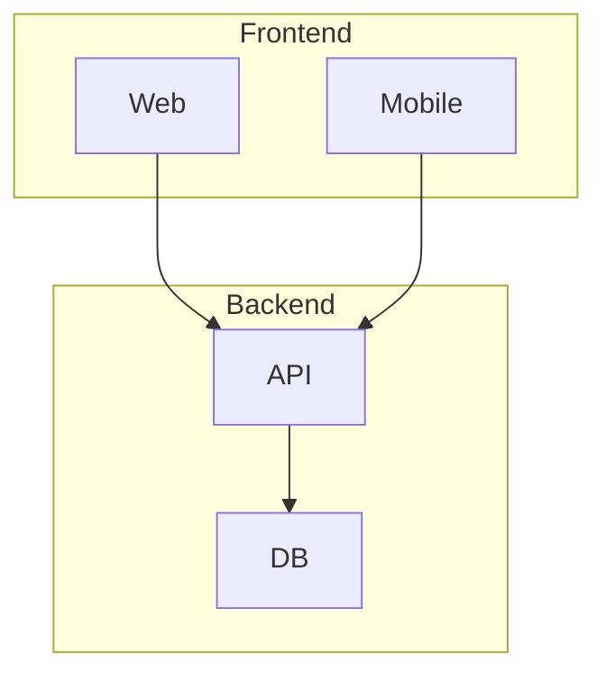

### Q: 既存のコードから図を生成できる？

**A**: 可能です。例えば：
```
以下のTypeScriptコードからクラス図を生成:
[コードを貼り付け]
```

## ライセンス

- Mermaid: MIT License
- PlantUML: GPL License
- このスキル: MIT License

---

**素晴らしい図を作成してください！** 📐
