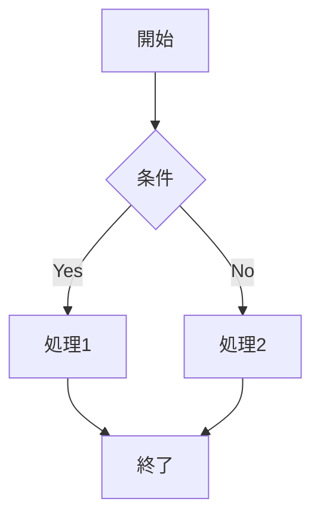
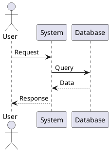
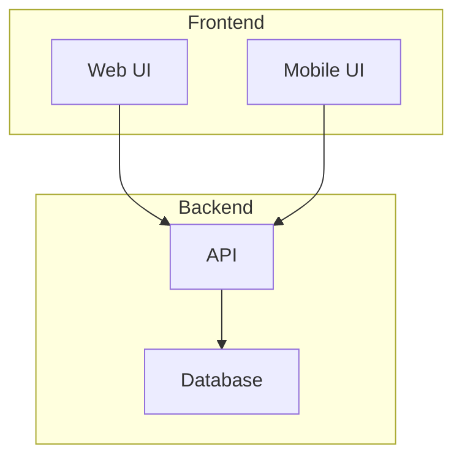
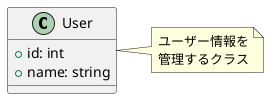
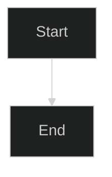

# UML Diagram Generation Skill

UML図とダイアグラムをMermaidおよびPlantUMLで生成するスキルです。

## 概要

このスキルを使用すると、システム設計、ソフトウェアアーキテクチャ、データフロー、プロセスフローなど、様々な図を自動生成できます。生成された図はHTMLで表示され、編集可能なコードも含まれます。

## 主な機能

- **豊富な図タイプ**: クラス図、シーケンス図、ER図、フローチャート、ステートマシン図など
- **2つのエンジン**: Mermaid（軽量・高速）とPlantUML（高機能）の両方をサポート
- **インタラクティブ**: ブラウザで即座に表示、ズーム、パン可能
- **エクスポート**: SVG、PNG形式でダウンロード可能
- **編集可能**: 生成されたコードを直接編集して即座に反映
- **テーマ対応**: ライト/ダークテーマ、カスタムスタイル
- **レスポンシブ**: あらゆる画面サイズに対応

## 使用方法

### 基本的な使い方

```
クラス図を作成してください。
クラス:
- User（ユーザー）
  - properties: id, name, email
  - methods: login(), logout()
- Product（商品）
  - properties: id, name, price
  - methods: getPrice(), setPrice()
関係: User "1" -- "*" Product
```

### シーケンス図

```
ログインシーケンス図を作成:
1. ユーザー → フロントエンド: ログイン情報入力
2. フロントエンド → API: POST /login
3. API → データベース: ユーザー検証
4. データベース → API: ユーザー情報返却
5. API → フロントエンド: JWT トークン
6. フロントエンド → ユーザー: ログイン成功
```

### フローチャート

```
注文処理フローチャートを作成:
開始 → 商品選択 → カート追加 → 在庫確認
→ 在庫あり?
  - YES → 決済処理 → 完了
  - NO → エラー表示 → 終了
```

## サポートする図タイプ

### 1. クラス図 (Class Diagram)

**用途**: オブジェクト指向設計、クラス構造の可視化

**主な要素**:
- クラス（プロパティ、メソッド）
- インターフェース
- 関係（継承、実装、関連、集約、コンポジション）
- 可視性（public, private, protected）

**例**:
```
以下のクラス図を作成:
- Animal（抽象クラス）
  - name: string
  - age: int
  - makeSound(): void
- Dog extends Animal
  - breed: string
  - bark(): void
- Cat extends Animal
  - color: string
  - meow(): void
```

### 2. シーケンス図 (Sequence Diagram)

**用途**: オブジェクト間の相互作用、処理フローの時系列表示

**主な要素**:
- アクター
- オブジェクト/コンポーネント
- メッセージ（同期、非同期）
- アクティベーション
- ライフライン

**例**:
```
ユーザー登録のシーケンス図:
ユーザー → UI: 登録情報入力
UI → バリデーター: 入力検証
バリデーター → UI: 検証結果
UI → API: POST /register
API → DB: ユーザー作成
DB → API: 成功
API → EmailService: 確認メール送信
API → UI: 登録完了
UI → ユーザー: 完了メッセージ
```

### 3. ER図 (Entity Relationship Diagram)

**用途**: データベース設計、エンティティ関係の可視化

**主な要素**:
- エンティティ（テーブル）
- 属性（カラム）
- 主キー、外部キー
- リレーションシップ（1:1, 1:N, N:M）

**例**:
```
ECサイトのER図:
- User
  - id (PK)
  - name
  - email
- Order
  - id (PK)
  - user_id (FK)
  - total_amount
- Product
  - id (PK)
  - name
  - price
- OrderItem
  - order_id (FK)
  - product_id (FK)
  - quantity

User 1--* Order
Order *--* Product (through OrderItem)
```

### 4. フローチャート (Flowchart)

**用途**: アルゴリズム、業務プロセスの可視化

**主な要素**:
- 開始/終了
- 処理ボックス
- 判断（条件分岐）
- 入出力
- ループ

**例**:
```
パスワードリセットフロー:
開始
→ メールアドレス入力
→ ユーザー存在確認
→ 存在する?
  YES → トークン生成
      → メール送信
      → リンククリック待機
      → 新パスワード入力
      → パスワード更新
      → 完了
  NO → エラー表示
     → 終了
```

### 5. ステートマシン図 (State Diagram)

**用途**: オブジェクトの状態遷移、ライフサイクル管理

**主な要素**:
- 状態
- 遷移
- イベント
- 開始状態、終了状態

**例**:
```
注文のステートマシン図:
[開始] → 新規注文
新規注文 --[支払い完了]--> 支払済
支払済 --[出荷]--> 発送済
発送済 --[配達完了]--> 完了
新規注文 --[キャンセル]--> キャンセル済
支払済 --[キャンセル]--> キャンセル済
```

### 6. アクティビティ図 (Activity Diagram)

**用途**: ビジネスプロセス、ワークフロー

**主な要素**:
- アクティビティ
- 分岐、結合
- フォーク、ジョイン（並列処理）
- スイムレーン（担当者別）

### 7. コンポーネント図 (Component Diagram)

**用途**: システムアーキテクチャ、モジュール構成

**主な要素**:
- コンポーネント
- インターフェース
- 依存関係
- パッケージ

**例**:
```
3層アーキテクチャのコンポーネント図:
- Presentation Layer
  - Web UI
  - Mobile UI
- Business Logic Layer
  - User Service
  - Order Service
  - Payment Service
- Data Access Layer
  - Database
  - Cache
  - External API
```

### 8. ガントチャート (Gantt Chart)

**用途**: プロジェクト管理、スケジュール計画

**例**:
```
プロジェクトスケジュール:
タスク1: 要件定義 (2024-01-01 to 2024-01-15)
タスク2: 設計 (2024-01-16 to 2024-02-15)
タスク3: 実装 (2024-02-16 to 2024-04-30)
タスク4: テスト (2024-04-01 to 2024-05-15)
タスク5: リリース (2024-05-16 to 2024-05-31)
```

### 9. ユーザージャーニーマップ

**用途**: UX設計、ユーザー体験の可視化

### 10. マインドマップ

**用途**: アイデア整理、概念マッピング

## Mermaid vs PlantUML

### Mermaid（推奨）

**メリット**:
- ブラウザで直接レンダリング（軽量）
- シンプルな構文
- リアルタイムプレビュー
- GitHub、GitLabで標準サポート
- モダンなデザイン

**対応図**:
- フローチャート ✅
- シーケンス図 ✅
- クラス図 ✅
- ステート図 ✅
- ER図 ✅
- ガントチャート ✅
- パイチャート ✅
- ユーザージャーニー ✅
- Gitグラフ ✅

**構文例**:


### PlantUML

**メリット**:
- より豊富な図タイプ
- 詳細なカスタマイズ
- UML標準準拠
- スキンテーマ豊富

**対応図**:
- すべてのUML図 ✅
- アーキテクチャ図 ✅
- ワイヤーフレーム ✅
- JSON/YAML可視化 ✅

**構文例**:


## カスタマイズオプション

### テーマ

**Mermaid テーマ**:
- `default` - デフォルト
- `dark` - ダークモード
- `forest` - 緑系
- `neutral` - ニュートラル
- `base` - ベース

**PlantUML スキン**:
- `bluegray` - ブルーグレー
- `cerulean-outline` - セルリアン
- `sketchy-outline` - スケッチ風
- `vibrant` - ビビッド

### 色のカスタマイズ

```
クラス図を作成:
- Userクラス: 背景色=#lightblue
- Adminクラス: 背景色=#lightcoral
スタイル: モダン
```

### フォントとサイズ

```
大きめのフォントでフローチャートを作成
フォントサイズ: 16px
フォントファミリー: Arial
```

## 実装例

### 例1: マイクロサービスアーキテクチャ図

**入力**:
```
マイクロサービスアーキテクチャのコンポーネント図を作成:

フロントエンド:
- Web App
- Mobile App

API Gateway:
- Kong

サービス:
- User Service (Node.js)
- Order Service (Java)
- Payment Service (Python)
- Notification Service (Go)

データストア:
- PostgreSQL (User, Order)
- MongoDB (Product)
- Redis (Cache)

メッセージング:
- RabbitMQ
- Kafka

外部連携:
- Stripe API
- SendGrid API

すべてのサービスはDocker上で動作
```

**生成されるもの**:
- 完全なアーキテクチャ図（Mermaid）
- サービス間の依存関係
- データフロー
- 編集可能なコード

### 例2: ユーザー認証フロー

**入力**:
```
OAuth2.0認証フローのシーケンス図:

アクター:
- User (ユーザー)
- Client App (クライアントアプリ)
- Auth Server (認証サーバー)
- Resource Server (リソースサーバー)

フロー:
1. User → Client App: ログインボタンクリック
2. Client App → Auth Server: 認可リクエスト
3. Auth Server → User: ログイン画面表示
4. User → Auth Server: 認証情報入力
5. Auth Server → User: 認可確認
6. User → Auth Server: 許可
7. Auth Server → Client App: 認可コード
8. Client App → Auth Server: トークンリクエスト
9. Auth Server → Client App: アクセストークン
10. Client App → Resource Server: リソースリクエスト（トークン付き）
11. Resource Server → Client App: リソース返却
12. Client App → User: データ表示
```

### 例3: データベーススキーマ

**入力**:
```
ECサイトのER図:

テーブル:
1. users
   - id (PK, INT)
   - email (VARCHAR, UNIQUE)
   - password_hash (VARCHAR)
   - name (VARCHAR)
   - created_at (TIMESTAMP)

2. products
   - id (PK, INT)
   - name (VARCHAR)
   - description (TEXT)
   - price (DECIMAL)
   - stock (INT)
   - category_id (FK)

3. categories
   - id (PK, INT)
   - name (VARCHAR)
   - parent_id (FK, nullable)

4. orders
   - id (PK, INT)
   - user_id (FK)
   - total_amount (DECIMAL)
   - status (ENUM)
   - created_at (TIMESTAMP)

5. order_items
   - id (PK, INT)
   - order_id (FK)
   - product_id (FK)
   - quantity (INT)
   - price (DECIMAL)

6. reviews
   - id (PK, INT)
   - user_id (FK)
   - product_id (FK)
   - rating (INT)
   - comment (TEXT)
   - created_at (TIMESTAMP)

リレーション:
- users 1--* orders
- orders 1--* order_items
- products 1--* order_items
- products *--1 categories
- categories 1--* categories (self-reference)
- users 1--* reviews
- products 1--* reviews
```

## 図の表示

生成されたHTMLファイルは:

```bash
# ブラウザで直接開く
open diagram.html

# またはローカルサーバーで
python -m http.server 8000
# http://localhost:8000/diagram.html
```

## インタラクティブ機能

- **ズーム**: マウスホイールでズームイン/アウト
- **パン**: ドラッグで図を移動
- **エクスポート**: SVG/PNG形式でダウンロード
- **編集**: コードを直接編集して即座に反映
- **コピー**: 図のコードをクリップボードにコピー
- **テーマ切り替え**: ライト/ダーク切り替え

## エクスポート形式

### SVG（推奨）
- ベクター形式（拡大しても高画質）
- ファイルサイズ小
- 編集可能

### PNG
- ラスター形式
- 汎用性が高い
- ドキュメントへの埋め込みに便利

### コード
- Mermaid/PlantUML 構文
- Markdownファイルに埋め込み可能
- バージョン管理可能

## ベストプラクティス

### 図の設計

1. **シンプルに保つ**: 1つの図で1つの概念
2. **適切な抽象度**: 詳細すぎず、抽象的すぎず
3. **命名規則**: 一貫性のある名前付け
4. **レイアウト**: 読みやすい配置（左から右、上から下）
5. **色の使い方**: 意味のある色分け

### クラス図

- 関係性を明確に（継承、実装、関連）
- 重要なメソッドのみ記載
- インターフェースと実装クラスを区別

### シーケンス図

- 時系列を上から下へ
- アクターは左側に配置
- 複雑な分岐は別図に分割

### ER図

- 主キーを明確に
- 外部キー制約を表示
- 正規化レベルを考慮

### フローチャート

- 開始と終了を明確に
- 1つのフローは1つの結果へ
- 無限ループを避ける

## トラブルシューティング

### 図が表示されない

**原因**: Mermaid/PlantUMLライブラリの読み込みエラー
**解決**: インターネット接続確認、ブラウザコンソールでエラー確認

### 構文エラー

**原因**: 不正な構文
**解決**: コンソールエラーメッセージ確認、構文ドキュメント参照

### レイアウトが崩れる

**原因**: 要素が多すぎる、関係が複雑
**解決**: 図を分割、レイアウト方向を変更（TB, LR, RL, BT）

### 日本語が文字化け

**原因**: フォント設定
**解決**: UTF-8エンコーディング確認、日本語対応フォント指定

## 高度な機能

### サブグラフ（Mermaid）



### ノート・コメント（PlantUML）



### スタイリング（Mermaid）



## 参考リンク

- [Mermaid 公式ドキュメント](https://mermaid.js.org/)
- [Mermaid Live Editor](https://mermaid.live/)
- [PlantUML 公式サイト](https://plantuml.com/)
- [PlantUML Web Server](http://www.plantuml.com/plantuml/)

## 制限事項

- 非常に複雑な図はパフォーマンス低下の可能性
- PlantUMLはサーバーレンダリング必要（オンライン）
- 古いブラウザでは一部機能が動作しない可能性

## バージョン情報

- Mermaid: 10.6.0
- PlantUML: Latest (online)
- スキルバージョン: 1.0.0

---

**使用例:**

```
ECサイトの注文処理シーケンス図を作成してください。
アクター: User, Frontend, API, Database, PaymentGateway
フロー:
1. ユーザーが商品をカートに追加
2. チェックアウトボタンクリック
3. 注文情報をAPIに送信
4. 在庫確認
5. 決済処理
6. 注文確定
7. 確認メール送信
```

このプロンプトで、完全なシーケンス図HTMLが生成されます！
